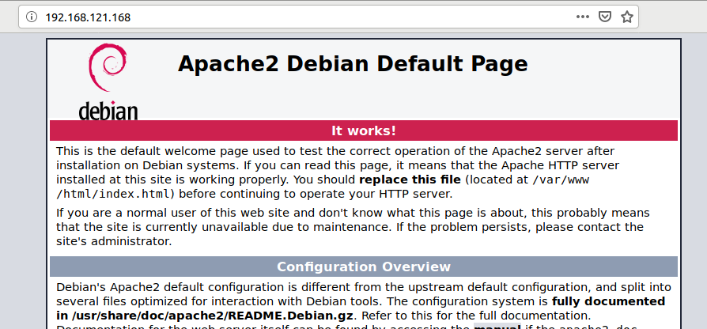

# Ejercicios: Uso de Sistemas

## Ejercicio 1

**Desplegar la aplicación de DAI con todos los módulos necesarios
usando un playbook de Ansible.**

*No curso esa asignatura*


## Ejercicio 2

**Instalar una máquina virtual Debian usando Vagrant y conectar con
ella.** 

Puesto que otras opciones
en [https://www.vagrantbox.es/](https://www.vagrantbox.es/) daban
problemas hemos cogido debian jessie como indican en
la [página oficial](https://app.vagrantup.com/debian/boxes/jessie64).

```
>$ vagrant init debian/jessie64
A `Vagrantfile` has been placed in this directory. You are now
ready to `vagrant up` your first virtual environment! Please read
the comments in the Vagrantfile as well as documentation on
`vagrantup.com` for more information on using Vagrant.

>$ vagrant up debian/jessie64

// Esto descarga la imagen

>$ vagrant ssh

The programs included with the Debian GNU/Linux system are free software;
the exact distribution terms for each program are described in the
individual files in /usr/share/doc/*/copyright.

Debian GNU/Linux comes with ABSOLUTELY NO WARRANTY, to the extent
permitted by applicable law.
vagrant@jessie:~$
```


## Ejercicio 3

**Crear un script para provisionar nginx o cualquier otro servidor web
que pueda ser útil para alguna otra práctica**

En lugar de nginx hemos extendido el ejemplo anterior para provisionar
con apache a nuestra máquina virtual.


```ruby
Vagrant.configure("2") do |config|
  config.vm.box = "envimation-VAGRANTSLASH-ubuntu-xenial"
  config.vm.network "forwarded_port", guest: 5000, host: 8080

  # Install emacs
  config.vm.provision "shell", inline: <<-SHELL
     apt-get update
     apt-get install -y emacs
     apt-get install -y apache2
   SHELL
end
```

Destacando el reenvío de puertos para poder acceder al servidor web de
nuestra máquina virtual. Esto lo hacemos con `config.vm.network`.




## Ejercicio 4

**Configurar tu máquina virtual usando vagrant con el provisionador
chef.​**

Hemos partido de un supuesto en el que queramos tener una máquina
virtual con git y emacs. *Lo básico que necesita un desarrollador*.

Para provisionarlo con vagrant hemos dispuesto un par de ficheros para
los *cookbooks* de chef en un subdirectorio
`./cookbooks/nombre_paquete_a_instalar/recipes/default.rb`. Cada uno
de estos ficheros contiene una línea que describe qué paquete hay que
instalar: `package 'git'` o `package 'emacs'` según corresponda.

Después el archivo Vagrantfile contendría lo siguiente:

```ruby
  config.vm.provision "chef_solo" do |chef|
    chef.add_recipe "emacs"
    chef.add_recipe "git"
  end
```

Finalmente para provisionar nuestra máquina virtual habría que, si
teníamos la máquina virtual encendida utilizar `vagrant reload` para
configurar los archivos de chef, y posteriormente ya podríamos
indicarle la provisión explícitamente con `vagrant provision`.


