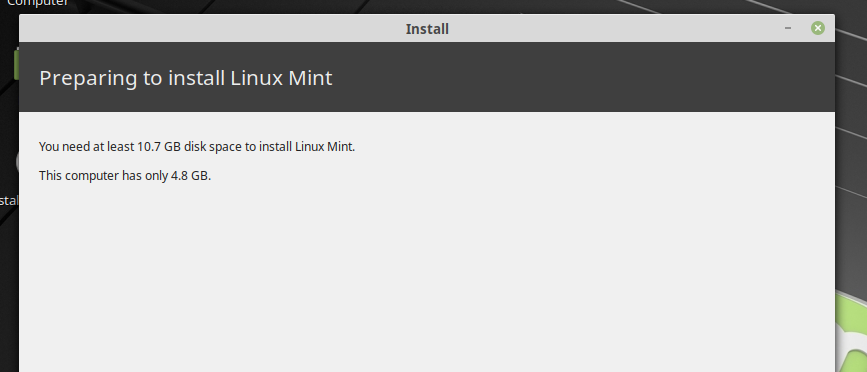

# Ejercicios: Uso de Sistemas

## Ejercicio 1

**Instalar los paquetes necesarios para usar KVM. Se pueden seguir estas
instrucciones. Ya lo hicimos en el primer tema, pero volver a
comprobar si nuestro sistema está preparado para ejecutarlo o hay que
conformarse con la paravirtualización.**

Para (volver a) comprobar esto se puede utilizar la orden `kvm-ok`,
que nos devuelve la siguiente salida:

```
INFO: /dev/kvm exists
KVM acceleration can be used
```


## Ejercicio 2

**Crear varias máquinas virtuales con algún sistema operativo libre
tal como Linux o BSD. Si se quieren distribuciones que ocupen poco
espacio con el objetivo principalmente de hacer pruebas se puede usar
CoreOS (que sirve como soporte para Docker) GALPon Minino, hecha en
Galicia para el mundo, Damn Small Linux, SliTaz (que cabe en 35 megas)
y ttylinux (basado en línea de órdenes solo).**

**Hacer un ejercicio equivalente usando otro hipervisor como Xen,
VirtualBox o Parallels.***

En primer lugar se ha dispuesto un disco para el almacenamiento:

```
$prompt> qemu-img create -f qcow2 slitaz-rolling.qcow2 1G
```

Y posteriormente, dado que por línea de órdenes había problemas de
configuración y derivaba en errores de tipo Kernel Panic (no conseguía
configurar el almacenamiento) se han configurado las máquinas con
`virt-manager`, que ha podido finalizar la instalación.

## Ejercicio 4

**Crear una máquina virtual Linux con 512 megas de RAM y entorno
gráfico LXDE a la que se pueda acceder mediante VNC y ssh.**

*Se ha intentado pero tengo problemas de memoria y todas las distros
con LXDE acaban siendo pesadas y dan problemas al instalarlas :(*


## Ejercicio 5

**Crear una máquina virtual Ubuntu e instalar en ella alguno de los
servicios que estamos usando en el proyecto de la asignatura.** 

Hemos creado una máquina virtual en Azure con Ubuntu 18.04. Nos hemos
conectado por ssh. Para instalar nuestro servicio nos hemos descargado
el [repositorio del proyecto](https://github.com/jojelupipa/Duckpiler)
hemos descargado npm y hemos seguido los pasos que se indican en el
README.md para descargar las dependencias y ejecutar el servicio.

## Ejercicio 6

**Instalar una máquina virtual con Linux Mint para el hipervisor que
tengas instalado.**

Usando KVM y haciendo uso también de `virt-manager` (para solventar
los mismos problemas de asignación del disco virtual por terminal) se
puede descargar la versión de Linux Mint deseada. *(Por desgracia sigo
con problemas de memoria y esto ha sido complicado de realizar, en el
momento nos encontramos en tareas de mantenimiento para conseguir el
espacio necesario para esta prueba)*


